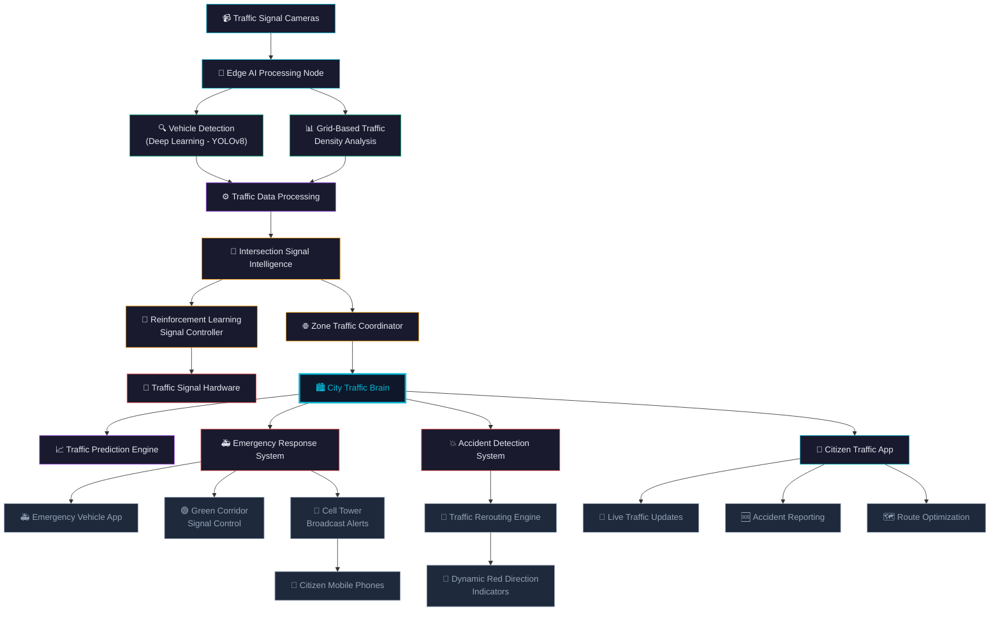
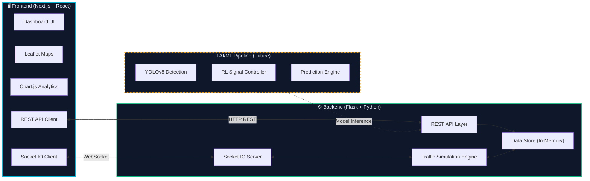
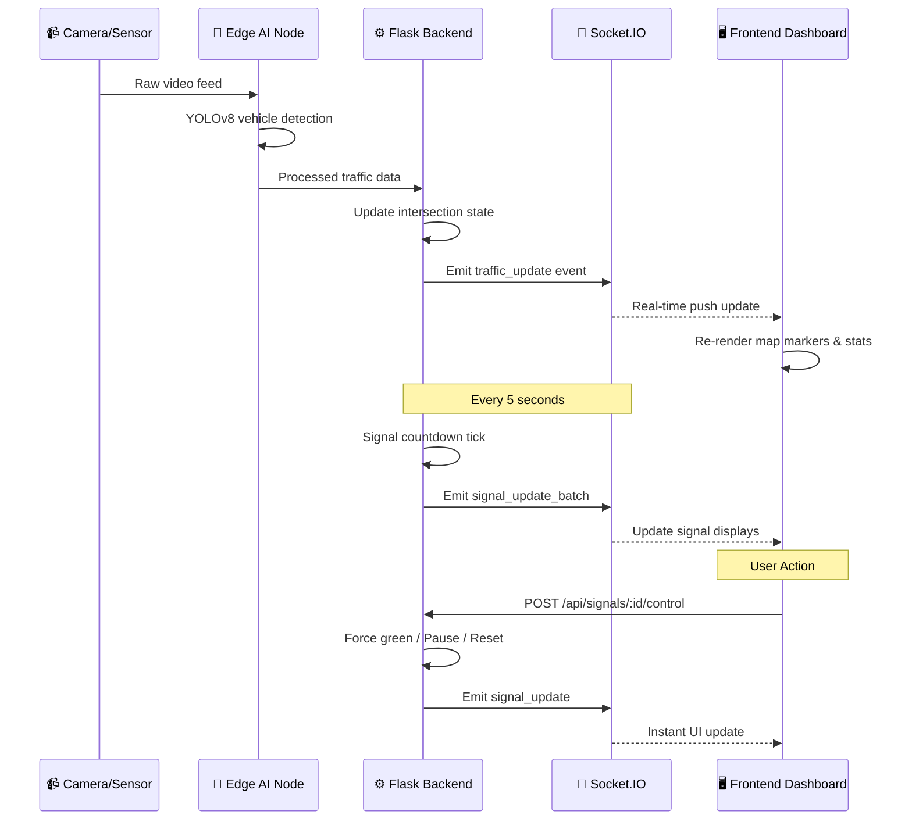
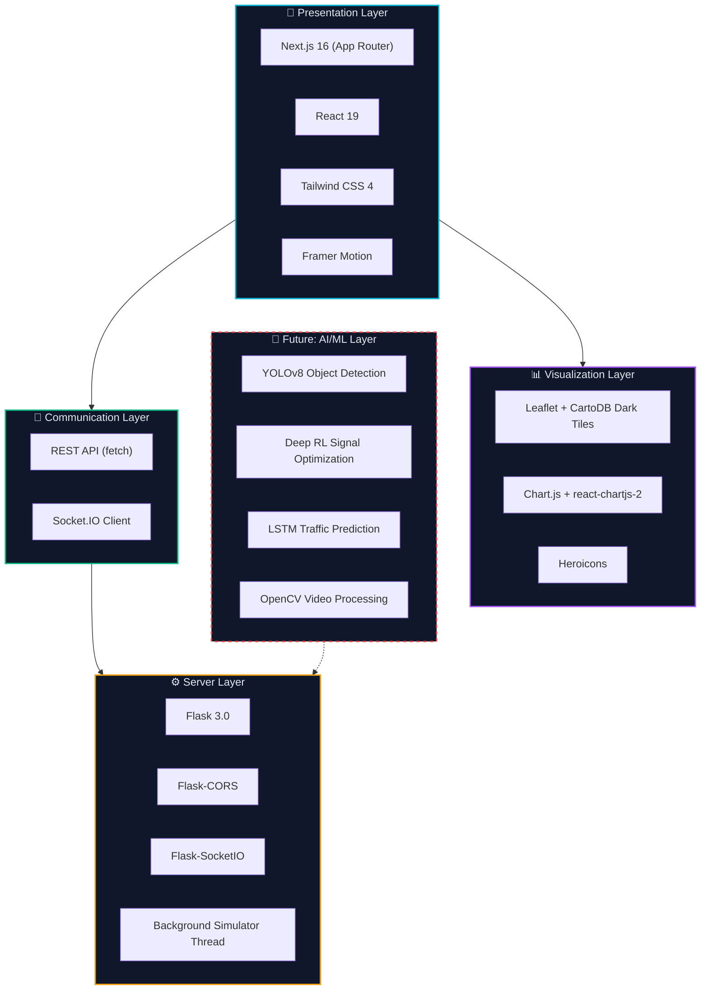

<div align="center">

# 🚦 TrafficAI — Intelligent Traffic Management System

### AI-Powered Smart City Traffic Command Center

[](https://nextjs.org/)
[](https://react.dev/)
[](https://tailwindcss.com/)
[](https://flask.palletsprojects.com/)
[](https://socket.io/)
[](https://www.chartjs.org/)
[](https://leafletjs.com/)
[](https://www.typescriptlang.org/)
[](https://www.python.org/)
[](LICENSE)

<br/>

> **A real-time AI-powered traffic management dashboard** designed for city traffic authorities to monitor intersections, control signals, manage emergency corridors, and detect incidents — all from a single command center interface.

### 🔴 [Live Demo](https://ai-traffic-flow-optimizer-and-emerg.vercel.app) | 🎥 [Demo Video](https://drive.google.com/file/d/1IUy0aksL1vYK7IJwA7jVrZkiXT1F8fA-/view?usp=sharing)

[🚀 Getting Started](#-getting-started) · [📖 Features](#-features) · [🏗️ Architecture](#️-system-architecture) · [📡 API Reference](#-api-reference) · [🎯 Pages](#-dashboard-pages)

</div>

---

## 📌 Problem Statement

Urban traffic congestion leads to **₹1.5 lakh crore** annual economic losses in India. Current traffic management relies on:
- ❌ Fixed-timer signals that ignore real-time conditions
- ❌ Manual monitoring with limited camera coverage
- ❌ Delayed emergency response due to congested routes
- ❌ No predictive capabilities for congestion prevention

**TrafficAI** solves this with an **AI-driven, real-time adaptive system** that brings intelligence to every intersection.

---

## ✨ Features

<table>
<tr>
<td width="50%">

### 🗺️ Real-Time Monitoring
- Live city map with color-coded intersections
- 🟢 Green = Low Traffic
- 🟡 Yellow = Moderate Traffic
- 🔴 Red = Heavy Congestion
- Vehicle detection with AI bounding boxes
- Lane-wise density heatmaps

</td>
<td width="50%">

### 🚦 AI Signal Control
- AI-recommended signal timing (RL-based)
- Manual override controls (Force Green / Pause / Reset)
- Live countdown timers
- Signal efficiency scoring per intersection

</td>
</tr>
<tr>
<td width="50%">

### 🚑 Emergency Management
- Real-time emergency vehicle tracking
- Green corridor activation/deactivation
- Route visualization on map
- ETA calculation and display

</td>
<td width="50%">

### ⚠️ Incident Detection
- Automatic accident detection alerts
- Road blockage identification
- Congestion spike detection
- AI-suggested alternate routes

</td>
</tr>
<tr>
<td width="50%">

### 📊 Analytics & Prediction
- Congestion trends by hour/zone
- Signal efficiency analytics
- Emergency response time tracking
- AI-powered traffic prediction (6hr horizon)

</td>
<td width="50%">

### 🔌 Real-Time Architecture
- WebSocket-based live updates
- REST API backend
- Background traffic simulation engine
- Multi-channel event system

</td>
</tr>
</table>

---

## 🏗️ System Architecture

### High-Level System Flow



### Application Architecture



### Real-Time Data Flow



---

## 🎯 Dashboard Pages

### 1️⃣ Dashboard Overview — `/`
> **The command center view** — A bird's-eye view of the entire city traffic network

| Component | Description |
|-----------|-------------|
| 📊 **KPI Widgets** | Active Intersections, Avg Congestion Score, Emergency Corridors, Active Incidents |
| 🗺️ **City Map** | Leaflet map with color-coded intersection markers (green/yellow/red) |
| 📈 **Charts** | Traffic Density over Time, Average Wait Time, Signal Efficiency |

### 2️⃣ Intersection Monitoring — `/intersections`
> **Deep-dive into any intersection** — Three-panel real-time monitoring layout

| Panel | Content |
|-------|---------|
| 🎥 **Left — Camera Feed** | Simulated live feed with AI vehicle detection bounding boxes |
| 🗺️ **Center — Map** | Zoomed intersection map with signal phase diagram |
| 📊 **Right — Statistics** | Lane-wise vehicle counts, density bars, queue lengths, signal countdown |

### 3️⃣ Signal Control — `/signals`
> **AI-assisted traffic signal management** with manual override

| Feature | Details |
|---------|---------|
| 🚦 **Traffic Lights** | Animated red/yellow/green with glow effects |
| 🤖 **AI Timing** | Recommended green/yellow/red durations from RL model |
| 🎮 **Controls** | Force Green, Pause Signal, Reset to Auto buttons |
| ⏱️ **Countdown** | Live countdown timer with animated transitions |

### 4️⃣ Emergency Corridor — `/emergency`
> **Emergency vehicle tracking** and green corridor activation

| Feature | Details |
|---------|---------|
| 🗺️ **Route Map** | Emergency vehicle positions + highlighted route paths |
| 📋 **Vehicle List** | ID, type (🚑🚒🚓), status, clickable selection |
| ℹ️ **Info Panel** | Current location, destination, ETA |
| 🟢 **Corridor Toggle** | Activate/Deactivate emergency corridor buttons |

### 5️⃣ Incident Monitoring — `/incidents`
> **Real-time incident detection** with smart rerouting

| Feature | Details |
|---------|---------|
| 🗺️ **Incident Map** | Markers for accidents (⚠️), blockages (🚧), congestion spikes (⚡) |
| 🔍 **Filters** | Filter by type: All / Accident / Blockage / Congestion |
| 📋 **Detail Cards** | Type, location, severity badge, status, description |
| 🔀 **Alt Routes** | AI-suggested alternate routes displayed on map |

### 6️⃣ Analytics — `/analytics`
> **Comprehensive traffic analytics** and predictive insights

| Feature | Details |
|---------|---------|
| 📊 **6 Charts** | Congestion by Hour, Signal Efficiency, Emergency Response, Traffic Prediction, Density by Zone, Wait Time |
| 🎛️ **Filters** | Date range, Zone selector, Intersection dropdown |
| 📋 **Performance Table** | All intersections with congestion %, vehicles, wait time, signal phase |
| 📈 **KPI Cards** | Avg Congestion, Signal Efficiency, Response Time, Incidents Today |

---

## 📡 API Reference

### Base URL: `http://localhost:5001/api`

<details>
<summary><b>🔗 Traffic & Intersections</b></summary>

| Method | Endpoint | Description |
|--------|----------|-------------|
| `GET` | `/intersections` | List all intersections with real-time data |
| `GET` | `/intersections/:id` | Get single intersection details |
| `GET` | `/intersections/stats` | Aggregate stats (avg congestion, vehicle count) |

**Example Response — `/api/intersections/stats`**
```json
{
  "totalActive": 12,
  "avgCongestionScore": 56,
  "heavyCount": 4,
  "moderateCount": 4,
  "lowCount": 4,
  "totalVehicles": 2557
}
```
</details>

<details>
<summary><b>🚦 Signal Control</b></summary>

| Method | Endpoint | Description |
|--------|----------|-------------|
| `GET` | `/signals` | List all signals |
| `GET` | `/signals/:id` | Get signal details |
| `POST` | `/signals/:id/control` | Manual control (force_green / pause / reset) |

**POST Body:**
```json
{ "action": "force_green" }
```
</details>

<details>
<summary><b>⚠️ Incidents</b></summary>

| Method | Endpoint | Description |
|--------|----------|-------------|
| `GET` | `/incidents` | List incidents (filterable: `?type=accident&severity=high`) |
| `GET` | `/incidents/:id` | Get incident with alternate routes |
| `GET` | `/incidents/summary` | Count by type and status |

</details>

<details>
<summary><b>🚑 Emergency</b></summary>

| Method | Endpoint | Description |
|--------|----------|-------------|
| `GET` | `/emergency/vehicles` | List all emergency vehicles |
| `GET` | `/emergency/vehicles/:id` | Get vehicle details with route |
| `POST` | `/emergency/vehicles/:id/corridor` | Activate/deactivate corridor |

</details>

<details>
<summary><b>📊 Analytics</b></summary>

| Method | Endpoint | Description |
|--------|----------|-------------|
| `GET` | `/analytics/traffic-density` | Traffic density by zone over time |
| `GET` | `/analytics/congestion-by-hour` | Hourly congestion averages |
| `GET` | `/analytics/signal-efficiency` | Per-intersection signal efficiency |
| `GET` | `/analytics/emergency-response` | Weekly response time trends |
| `GET` | `/analytics/prediction` | 6-hour traffic prediction |
| `GET` | `/analytics/summary` | KPI summary stats |

</details>

<details>
<summary><b>🔌 Socket.IO Events</b></summary>

| Event | Direction | Description |
|-------|-----------|-------------|
| `traffic_update` | Server → Client | Real-time intersection data (every 5s) |
| `signal_update_batch` | Server → Client | All signal countdown updates |
| `signal_update` | Server → Client | Individual signal state change |
| `corridor_update` | Server → Client | Emergency corridor toggle |
| `incident_alert` | Server → Client | New incident detected |

</details>

---

## 📁 Project Structure

```
INDIA_INNOVATES/
│
├── 📂 backend/                        # Python Flask Backend
│   ├── app.py                         # Main server (REST + Socket.IO + Simulation)
│   └── requirements.txt               # Python dependencies
│
├── 📂 src/                            # Next.js Frontend
│   ├── 📂 app/                        # Pages (App Router)
│   │   ├── layout.tsx                 # Root layout (Sidebar + TopBar)
│   │   ├── globals.css                # Dark cyberpunk theme
│   │   ├── page.tsx                   # Dashboard Overview
│   │   ├── 📂 intersections/          # Intersection Monitoring
│   │   ├── 📂 signals/                # Signal Control
│   │   ├── 📂 emergency/              # Emergency Corridor
│   │   ├── 📂 incidents/              # Incident Monitoring
│   │   └── 📂 analytics/              # Analytics & Reports
│   │
│   ├── 📂 components/                 # Reusable UI Components
│   │   ├── 📂 layout/                 # Sidebar, TopBar
│   │   ├── 📂 maps/                   # MapView (Leaflet)
│   │   ├── 📂 traffic/                # StatsCard, CameraFeed
│   │   ├── 📂 signals/                # SignalControlPanel
│   │   ├── 📂 alerts/                 # IncidentAlertPanel
│   │   └── 📂 charts/                 # AnalyticsChart (Chart.js)
│   │
│   ├── 📂 services/                   # API & Socket.IO Client
│   │   ├── api.ts                     # REST API service layer
│   │   └── socket.ts                  # Socket.IO real-time client
│   │
│   └── 📂 lib/                        # Utilities & Mock Data
│       └── mockData.ts                # Hardcoded demo data
│
├── package.json
├── tailwind.config.ts
├── tsconfig.json
└── README.md
```

---

## 🚀 Getting Started

### Prerequisites

| Tool | Version |
|------|---------|
| Node.js | >= 18.x |
| Python | >= 3.9 |
| npm | >= 9.x |

### Installation

```bash
# 1. Clone the repository
git clone https://github.com/your-username/INDIA_INNOVATES.git
cd INDIA_INNOVATES

# 2. Install frontend dependencies
npm install

# 3. Install backend dependencies
cd backend
pip3 install -r requirements.txt
cd ..
```

### Running the Application

```bash
# Terminal 1 — Frontend (http://localhost:3000)
npm run dev

# Terminal 2 — Backend (http://localhost:5001)
cd backend
python3 app.py
```

> 💡 Open **http://localhost:3000** in your browser to access the dashboard.

### Build for Production

```bash
npm run build
npm start
```

---

## 🛠️ Tech Stack Deep Dive



---

## 🤖 AI/ML Components (Planned)

| Component | Technology | Purpose |
|-----------|-----------|---------|
| **Vehicle Detection** | YOLOv8 + OpenCV | Real-time vehicle counting and classification from camera feeds |
| **Signal Optimization** | Deep Reinforcement Learning (DQN) | Adaptive signal timing that learns from traffic patterns |
| **Traffic Prediction** | LSTM Neural Network | 6-hour congestion forecasting for proactive management |
| **Accident Detection** | CNN-based Anomaly Detection | Automatic accident identification from camera feeds |
| **Density Analysis** | Grid-based Heatmap Algorithm | Lane-wise traffic density calculation |

---

## 🎨 Design Philosophy

The UI is designed as a **professional traffic command center** with:

| Aspect | Implementation |
|--------|---------------|
| 🌑 **Dark Theme** | Navy/slate background (`#0a0e1a`) reducing eye strain for 24/7 operators |
| ✨ **Neon Accents** | Cyan, green, amber, red — following traffic signal conventions |
| 🔮 **Glassmorphism** | Frosted glass panels with `backdrop-blur` for depth |
| 💡 **Glowing Indicators** | CSS `box-shadow` glow effects on traffic signals and status dots |
| 🎬 **Micro-animations** | Framer Motion transitions, pulsing dots, scanner lines |
| 📱 **Responsive** | Adapts from 1080p monitors to ultrawide command center displays |

---

## 👥 Team

| Name | Role |
|------|------|
| Archit Mittal | Full-Stack Developer |

---

## 📄 License

This project is licensed under the **MIT License** — see the [LICENSE](LICENSE) file for details.

---

<div align="center">

### Built with ❤️ for India Innovates

**🚦 Making India's roads smarter, safer, and more efficient**

[](https://github.com/your-username/INDIA_INNOVATES)
[](https://github.com/your-username/INDIA_INNOVATES)

</div>
